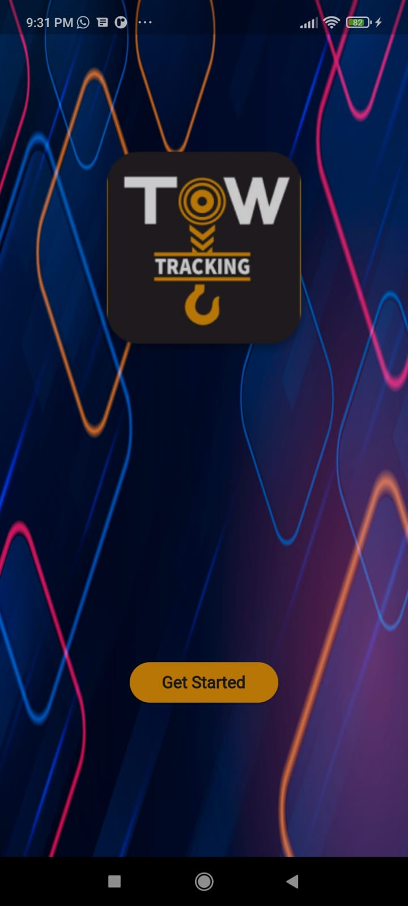
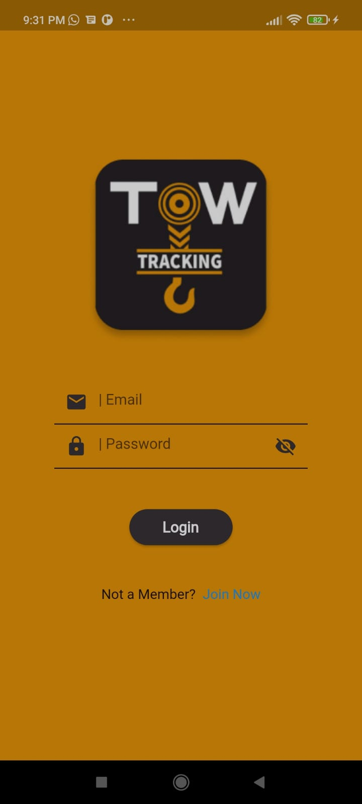
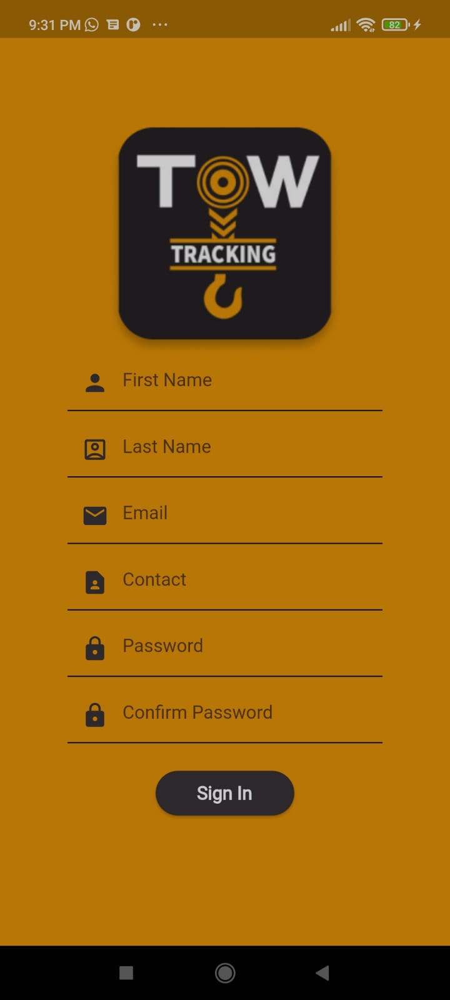
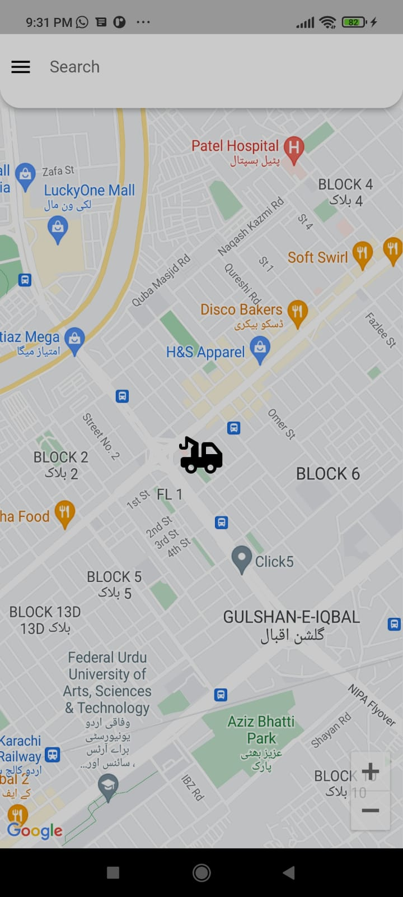
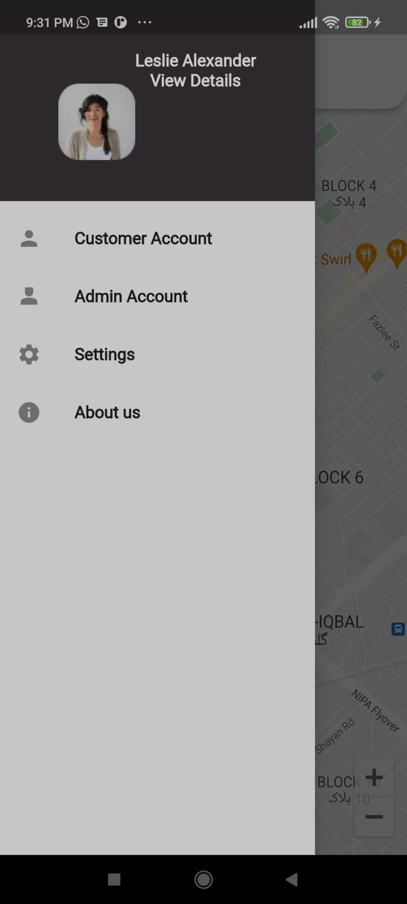

# Tow Tracking App

The Tow Tracking App is a mobile application developed using the Flutter framework, which provides a real-time tracking system for tow trucks. The app is designed to track the location of tow trucks in real-time and help users locate and monitor the tow trucks.
## Features

1. You can check closest tow service.
2. You can find our details in Contact now.
3. Monitoring of tow truck location and direction of travel.
4. Integration with Google Maps for accurate and reliable mapping.

Design inspired by : https://www.figma.com/file/iM25JvoPUmhwBnsTMWYefq/Tow-Tracking-(Community)?type=design&node-id=13-2&t=xVCQYU0GwteMwTtf-0

## Screenshots

